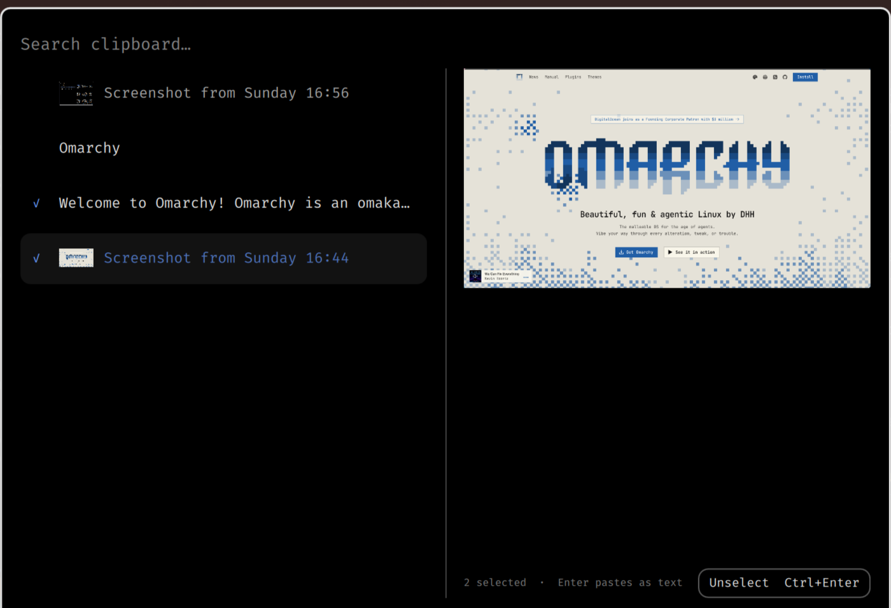

# Clipstack for Omarchy

A replacement for Omarchy's clipboard overlay that adds two things to it: **tick
several entries and act on them together**, and **edit a text entry in place**.



Select entries with `Ctrl+Enter`, then `Enter` pastes them as one payload. Text
entries join with newlines; images contribute their `file://` path; a selection of
nothing but images or files is copied as `text/uri-list`, so file managers and
image editors receive it as files.

`Ctrl+E` opens the selected text entry in the detail pane, `Ctrl+Enter` copies the
edit as a new entry, and `Esc` cancels with the original untouched.

## Requirements

Omarchy 4 (Quattro), whose shell plugin system this installs into.

## Install

```bash
omarchy plugin add https://github.com/Ahmed-Sinkeat/omarchy-clipstack.git
omarchy plugin enable sinkeat.clipstack
```

The manifest declares `omarchy.clonedFrom = omarchy.clipboard`, so the existing
`Super+Ctrl+V` binding routes here and Omarchy disables the built-in overlay. No
keybinding or config changes are required.

## Remove

```bash
omarchy plugin remove sinkeat.clipstack
```

That re-enables the built-in clipboard overlay and hands `Super+Ctrl+V` back to it.
Clipboard history in `~/.local/state/omarchy/` is Omarchy's own and is left alone.

## Dependencies

Everything it calls ships with Omarchy: `wl-clipboard`, `wtype`, `jq`, `perl`, and
the `omarchy-clipboard-*` helpers. No network access, no elevated privileges.

## Shortcuts

| Action | Shortcut |
|---|---|
| Tick the entry under the cursor | `Ctrl+Enter` |
| Paste every ticked entry as one payload | `Enter` |
| Copy them without pasting | `Shift+Enter` |
| Remove every ticked entry | `Delete` |
| Drop the selection | `Esc` |
| Edit the entry under the cursor | `Ctrl+E` |
| Copy the edit as a new entry | `Ctrl+Enter` (in the editor) |
| Cancel the edit | `Esc` |

Nothing has to be memorised: both actions are buttons in the detail pane
(`Select  Ctrl+Enter` and `Edit  Ctrl+E`), a ticked row is marked with an accent `✓`,
and the footer reads `3 selected · Enter pastes as files` — so the payload a paste
will produce is visible before you press it.

With nothing ticked every key keeps its stock behaviour: `Enter` pastes,
`Shift+Enter` copies, `Alt+Enter` opens, `Delete` removes, `Shift+Delete` clears.

A selection is tracked by entry content, not by row: the clipboard watcher rewrites
history on every copy and saving an edit prepends an entry, so ticks stay on the
entries you picked. An empty edit is not saved. Images offer no Edit action.

## Limits

Clipboard text is bounded at every step, so one huge copy can never stall or
exhaust the shell:

| | Limit |
|---|---|
| One text entry | 2 MB |
| All kept history | 8 MB, newest first, and at most 500 entries |
| History file accepted at startup | 32 MB |

A copy over 2 MB still pastes normally. It just isn't saved to history, and the
overlay says *Last copy not saved · over 2 MB* where it would have appeared.

The history file is checked before it is read. If it is something the overlay
could not have written — a symlink, a FIFO or other special file, a file over
32 MB, or invalid JSON — it is renamed to `clipboard-history.json.rejected-<time>`
and history starts empty. It is never overwritten and never followed.

## Layout

```text
manifest.json          plugin manifest, cloned from omarchy.clipboard
Clipboard.qml          overlay, selection state, and the editor pane
ClipboardHistory.js    history model, selection set, and payload join
ClipboardWrite.js      the wl-copy stdin lifecycle, shared by both writers
paste-selection.sh     copies a joined selection and pastes it
capture.sh             records each copy, skipping text over the entry limit
load-history.sh        checks and bounds the history file before the overlay reads it
test/                  regression tests
docs/                  design records and the upstream proposal
plan.md                the multi-select merge plan
```

## Verification

```bash
./test/clipstack-test.sh    # selection, join, byte limits, capture and load
qmllint Clipboard.qml       # QML parses
omarchy plugin validate .   # manifest
```

After a change to `Clipboard.qml`, run `omarchy-restart-shell`: a `keepLoaded`
overlay does not hot-reload.

Because the plugin is a clone, upstream changes to
`/usr/share/omarchy/shell/plugins/clipboard/Clipboard.qml` do not arrive on their
own. After an Omarchy update, check what moved:

```bash
diff -u /usr/share/omarchy/shell/plugins/clipboard/Clipboard.qml Clipboard.qml
```

## History

Clipstack began as **ClipEdit**, an `extension` plugin hosted by the built-in
clipboard through the slot proposed in [Omarchy PR #10919](https://github.com/omacom/omarchy/pull/10919),
which is still open. Multi-select cannot be expressed by that contract — it needs
selection state, row rendering and key handling in the host — so the editor moved
into the overlay and the extension slot was deleted. Nothing here waits on the PR
any more; it stands on its own merits upstream. See [plan.md](plan.md) for the
decision and [docs/](docs) for the earlier phases.

## License

Clipstack is available under the [MIT License](LICENSE).
